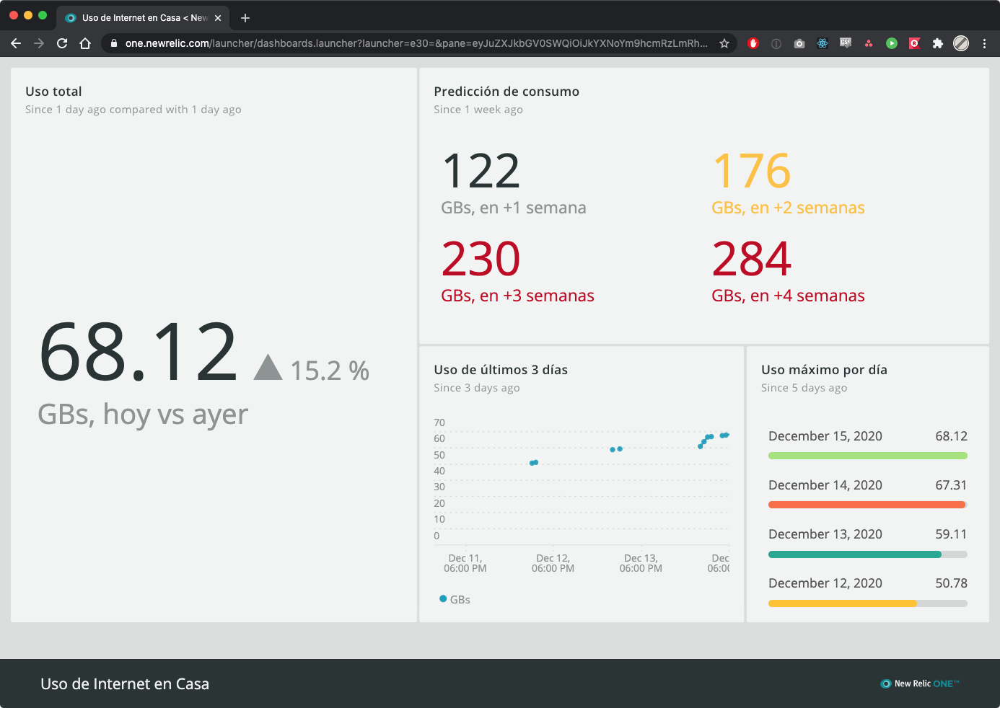

# Monitor de consumo de datos de Internet en Casa de Telcel

Si tienes el servicio de Internet en Casa de Telcel y quieres llevar un registro gráfico detallado de tu consumo, esto puede ayudarte a comenzar.

## Requerimientos

- Python 3
- Selenium Server y Chrome Driver
- Suscripción gratuita a [New Relic One](https://newrelic.com/signup) para guardar y visualizar el consumo

## Compatibilidad

- De instalador, solo MacOS
- De ejecución, donde sea que corran los requerimientos

## Instalación

Ejecutar `make install` que hará lo siguiente:

1. Crear un entorno virtual de python en `./.venv`
2. Descargar las dependencias de python según [requirements.txt](./source/requirements.txt)
3. Instalar Selenium Server y Chrome Driver


## Configuración

La configuración se encuentra en el archivo [config.py.dist](./source/config.py.dist), que debes renombrar a `config.py`, con las siguientes variables:

| Variable                   | Valor default                | Descripción                                                                                                                                           |
| :------------------------- | :--------------------------- | :---------------------------------------------------------------------------------------------------------------------------------------------------- |
| SELENIUM_URL               | http://127.0.0.1:4444/wd/hub |                                                                                                                                                       |
| SELENIUM_HEADLESS          | True                         | Si es True, el navegador arranca sin ventana                                                                                                          |
| ROUTER_HOST                | http://192.168.8.1           | URL al router de Telcel (viene debajo del router)                                                                                                     |
| ROUTER_PASSWORD            | -                            | El password de tu router (viene debajo del router)                                                                                                    |
| NEW_RELIC_ACCOUNT_ID       | -                            | El [ID](https://docs.newrelic.com/docs/accounts/accounts-billing/account-setup/account-id) de tu suscripción a New Relic One                          |
| NEW_RELIC_INSERT_KEY       | -                            | La llave de API para inserción de datos en New Relic One, generada en `https://insights.newrelic.com/accounts/<NEW_RELIC_ACCOUNT_ID>/manage/api_keys` |
| NEW_RELIC_INSIGHTS_API_URL | -                            | El URL del API de ingesta de datos de New Relic One, que es `https://insights-collector.newrelic.com/v1/accounts/<NEW_RELIC_ACCOUNT_ID>/events`       |


## Ejecución

### Manual

Ejecutar `make run` que hará lo siguiente:

1. Encender el Selenium Server
2. Ejecutar el monitor de consumo [monitor.py](./source/monitor.py)
3. Apagar el Selenium Server

### Automática

Para ejecutar este comando cada hora automáticamente, podemos agregarlo al crontab, con el comando `crontab -e` para abrir el editor, y agregando la instrucción, especificando la ruta absoluta a la raíz del proyecto para el comando `make`:

```sh
SHELL=/bin/bash
PATH=/bin:/usr/bin:/usr/local/bin/
0 * * * * make -C /ruta/a/monitor-internet-en-casa-telcel run >> /tmp/monitor-internet-en-casa-telcel.log 2>&1
```


## Monitor de consumo

El monitor de consumo [monitor.py](./source/monitor.py) hace lo siguiente:

1. Levanta un navegador Chrome en modo Headless (sin ventana)
2. En ese navagador, abre el la página del router telcel
3. Inicia sesión en el router y va la página de consumo de datos
4. Extrae el total mensual y lo envía a New Relic One
5. Imprime en la consola el total


## Visualización de consumo

Los datos de consumo se guardan en New Relic One como un custom event llamado `MonthlyUsage`.
Puedes verlo con las siguiente consultas NRQL desde el [Query Builder](https://docs.newrelic.com/docs/query-your-data/explore-query-data/query-builder/introduction-query-builder):


#### Uso total
Al día de hoy, comparado contra ayer:
```SQL
FROM MonthlyUsage SELECT latest(gigabytes_used) as 'GBs, hoy vs ayer' since 1 day ago COMPARE WITH 1 day ago
```
#### Predicción de uso
A partir de hoy, para dentro de 1 hasta 4 semanas en el futuro:
```SQL
FROM MonthlyUsage SELECT round(predictlinear(gigabytes_used, 1 week)) as 'GBs, en +1 semana', round(predictlinear(gigabytes_used, 2 weeks)) as 'GBs, en +2 semanas', round(predictlinear(gigabytes_used, 3 weeks)) as 'GBs, en +3 semanas', round(predictlinear(gigabytes_used, 4 weeks)) as 'GBs, en +4 semanas' SINCE 1 week ago
```
#### Uso en los últimos 3 días
```SQL
FROM MonthlyUsage SELECT latest(gigabytes_used) TIMESERIES SINCE 3 days ago
```
#### Uso máximo de los últimos 5 días
```SQL
FROM MonthlyUsage SELECT latest(gigabytes_used) as 'GBs' SINCE 5 days ago FACET dateOf(timestamp)
```


Esas consultas las puedes agregar a un dashboard de New Relic One para consultar tu consumo fácilmente, y puedes también crear alertas para saber si te estás acercando a tu límite mensual.

